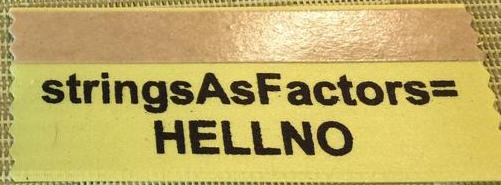

# Today's agenda

## Today's agenda

- Data wrangling with `dplyr`

```{r message=FALSE}
library(dplyr)
```

- A little bit of text parsing with `stringr`

- Working with NC bike crash data released by https://opendurham.nc.gov

# Getting started with data in R

## NC DOT Fatal Crashes in North Carolina {.smaller}

```{r echo=FALSE}
bike <- read.csv("nc_bike_crash.csv", 
                 sep = ";", stringsAsFactors = FALSE) %>%
  tbl_df()
```

From https://opendurham.nc.gov
```{r eval=FALSE}
bike <- read.csv("https://stat.duke.edu/~mc301/data/nc_bike_crash.csv", 
                 sep = ";", stringsAsFactors = FALSE) %>%
  tbl_df()
```

View the names of variables via
```{r}
names(bike)
```

and see detailed descriptions at https://stat.duke.edu/~mc301/data/nc_bike_crash.html.

## Aside: Strings (characters) vs factors

- By default R will convert character vectors into factors when they are
included in a data frame
- Sometimes this is useful, sometimes it isn’t – either way it is 
important to know what type/class you are working with
- This behavior can be changed using the `stringsAsFactors = FALSE` 
when loading a data drame



## Viewing your data {.smaller}

- In the Environment, click on the name of the data frame to view
it in the data viewer

- Use the `str()` function to compactly display the internal **str**ucture 
of an R object

```{r}
str(bike)
```

# Data wrangling

## Data wrangling with `dplyr`

The `dplyr` package is based on the concepts of functions as verbs that 
manipulate data frames:

- `filter()`: pick rows matching criteria
- `select()`: pick columns by name 
- `rename()`: rename specific columns
- `arrange()`: reorder rows 
- `mutate()`: add new variables
- `transmute()`: create new data frame with variables
- `sample_n()` / `sample_frac()`: randomly sample rows
- `summarise()`: reduce variables to values

## `dplyr` rules

- First argument is a data frame
- Subsequent arguments say what to do with data frame
- Always return a data frame 
- Avoid modify in place

## Filter rows with `filter()`

- Select a subset of rows in a data frame.
- Easily filter for many conditions at once.

## `filter()` {.smaller}

for crashes in Durham County

```{r}
bike %>%
  filter(County == "Durham")
```

## `filter()` {.smaller}

for crashes in Durham County where biker was < 10 yrs old

```{r}
bike %>%
  filter(County == "Durham", Bike_Age < 10)
```

## Commonly used logical operators in R {.smaller}

operator    | definition
------------|--------------------------
`<`         | less than
`<=`        |	less than or equal to
`>`         | greater than
`>=`        |	greater than or equal to
`==`        |	exactly equal to
`!=`        |	not equal to
`x | y`     | `x` OR `y`
`x & y`     | `x` AND `y`

## Commonly used logical operators in R {.smaller}

operator     | definition
-------------|--------------------------
`is.na(x)`   | test if `x` is `NA`
`!is.na(x)`  | test if `x` is not `NA`
`x %in% y`   | test if `x` is in `y`
`!(x %in% y)`| test if `x` is not in `y`
`!x`         | not `x`

## Aside: real data is messy! {.smaller}

<div class="question">
What in the world does a `BikeAge_gr` of `10-Jun` or `15-Nov` mean?
</div>

```{r}
bike %>%
  group_by(BikeAge_Gr) %>%
  summarise(crash_count = n())
```

## Careful data scientists clean up their data first!

- We're going to need to do some text parsing to clean up
these data
    + `10-Jun` should be `6-10`
    + `15-Nov` should be `11-15`
  
- New R package: `stringr`

## Install and load: `stringr`

- Install:
```{r eval=FALSE}
install.packages(stringr) # only have to do this once
```

- Load:
```{r}
library(stringr)
```

- Package reference: Most R packages come with a vignette that describe
in detail what each function does and how to use them, they're incredibly
useful resources (in addition to other worked out examples on the web)
https://cran.r-project.org/web/packages/stringr/vignettes/stringr.html

## Replace with `str_replace()` and add new variables with `mutate()` {.smaller}

- Remember we want to do the following in the `BikeAge_Gr` variable
    + `10-Jun` should be `6-10`
    + `15-Nov` should be `11-15`
 
```{r}
bike <- bike %>%
  mutate(BikeAge_Gr = str_replace(BikeAge_Gr, "10-Jun", "6-10")) %>%
  mutate(BikeAge_Gr = str_replace(BikeAge_Gr, "15-Nov", "11-15"))
```

- Note that we're overwriting existing data and columns, so be careful!
    + But remember, it's easy to revert if you make a mistake since we didn't
    touch the raw data, we can always reload it and start over

## Check before you move on {.smaller}

Always check your changes and confirm code did what you wanted it to do

```{r}
bike %>%
  group_by(BikeAge_Gr) %>%
  summarise(count = n())
```

## `slice()` for certain row numbers {.smaller}

First five
```{r}
bike %>%
  slice(1:5)
```

## `slice()` for certain row numbers {.smaller}

Last five
```{r}
last_row <- nrow(bike)
bike %>%
  slice((last_row-4):last_row)
```

## `select()` to keep only the variables you mention {.smaller}

```{r}
bike %>%
  select(Crash_Loc, Hit_Run) %>%
  table()
```

## or `select()`to exclude variables {.smaller}

```{r}
bike %>%
  select(-OBJECTID)
```

## `rename()` specific columns {.smaller}

Useful for correcting typos, and renaming to make variable names shorter 
and/or more informative

- Original names:
```{r}
names(bike)
```

- Rename `Speed_Limi` to `Speed_Limit`:
```{r}
bike <- bike %>%
  rename(Speed_Limit = Speed_Limi)
```

## Check before you move on {.smaller}

Always check your changes and confirm code did what you wanted it to do

```{r}
names(bike)
```

## `summarise()` in a new data frame {.smaller}

```{r}
bike %>%
  group_by(BikeAge_Gr) %>%
  summarise(crash_count = n()) %>%
  arrange(crash_count)
```

## and `arrange()` to order rows {.smaller}

```{r}
bike %>%
  group_by(BikeAge_Gr) %>%
  summarise(crash_count = n()) %>%
  arrange(desc(crash_count))
```

## Select rows with `sample_n()` or `sample_frac()` {.smaller}

- `sample_n()`: randomly sample 5 observations
```{r}
bike_n5 <- bike %>%
  sample_n(5, replace = FALSE)
dim(bike_n5)
```

- `sample_frac()`: randomly sample 20% of observations
```{r}
bike_perc20 <-bike %>%
  sample_frac(0.2, replace = FALSE)
dim(bike_perc20)
```