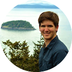

The IDC meets Mondays 6-7:30pm at Market Place Upper East. These sessions will generally feature a guest speaker and dinner will be provided.

* * *

#### Week 1 (Aug 24): 

No meeting.

* * *

#### Week 2 (Aug 31): 

### Meet the 'What If?' team

**Speakers**: 

* Mine Cetinkaya-Rundel, Statistical Science
* Anita Layton, Mathematics
* Jenny Tung, Evolutionary Anthropology
* Lynn Smith-Lovin, Sociology
* Michael Peper, Duke Libraries

* * *

#### Week 3 (Sep 7): 

**Host:** Anita Layton

{:.right}

**Speaker**: Regis Kopper  
Director of Duke DiVE

* * *

#### Week 4 (Sep 14):

**Host:** Mine Çetinkaya-Rundel

{:.right}

**Speaker**: Beka Steorts  
Assistant Professor of Statistical Science

* * *

#### Week 5 (Sep 21):

**Host:** Mine Çetinkaya-Rundel

{:.right}

**Speaker:** Jesse Windle  
Director of Data Science at Hi Fidelity Genetics

* * *

#### Field Trip (Sep 26):

Trip to Beaufort, NC.

* * *

#### Week 6 (Sep 28):

No meeting

* * *

#### Week 7 (Oct 5):

**Host:** Mine Çetinkaya-Rundel

{:.right}

**Speaker:** Colin Rundel  
Assistant Professor of the Practice of Statistical Science

* * *

#### Week 8 (Oct 12):

Fall Break - no meeting

* * * 

#### Week 9 (Oct 19):

**Host:** Anita Layton

{:.right}

**Speaker**: Nimmi Ramanujam  
Professor of Biomedical Engineering

* * * 

#### Week 10 (Oct 26):

**Host:** Anita Layton

{:.right}

**Speaker**: Xiaobai Sun  
Professor of Computer Science

* * * 

#### Week 11 (Nov 2):

**Host:** Anita Layton

{:.right}

**Speaker:** Krystal George  
Duke Women's Center's Office of Gender Violence Prevention & Intervention

* * * 

#### Week 12 (Nov 9):

**Host:** Mine Çetinkaya-Rundel

{:.right}

**Speaker:** David Clancy  
Undergraduate student at Department of Statistical Science & Mathematics

* * * 

#### Week 13 (Nov 16):

**Host:** Anita Layton

{:.right}

**Speaker:** Paul Bendich  
Associate Director for Undergraduate Research at iiD

* * * 

#### Week 14 (Nov 23):

No meeting

* * * 

#### Week 15 (Nov 30):

**Host:** Mine Çetinkaya-Rundel

**Speaker:** Lucy Lu  
Undergraduate student at Department of Statistical Science