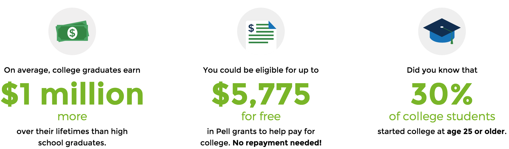

## Background

In early September 2015 The Obama Administration has launched [College 
Scorecard](https://collegescorecard.ed.gov/). According to the [NYTimes](http://www.nytimes.com/2015/09/13/us/with-website-to-research-colleges-obama-abandons-ranking-system.html) this website *"does not attempt to rate schools with any 
kind of grade, but provides information to prospective students and their parents 
about annual costs, graduation rates and salaries after graduation."*

The goal of this assignment is to work with semistructured data obtained from the web
to answer a research question of interest to you (that is, your team) about US
colleges using tools and techniques you have learned in the course so far. That is, you
will wrangle the data into a format that is usable for your research question, explore
it using visualizations and descriptive statistics, and model outcomes of interest
to you. However the main goal is **visualization**.

There are any number of ways to approach this task, there is no one right solution - 
be as creative as possible. If you want to supplement these data with outside sources,
including additional data provided on the College Scorecard website, you're welcomed
to do so. Just be sure to document where the data comes from and why it is included. 

## Data

#### Dataset 

The specific dataset you will use for this project can be found at 
https://collegescorecard.ed.gov/data/. The file is called *Most recent data 124 MB 
csv*. Click [here](https://s3.amazonaws.com/ed-college-choice-public/Most+Recent+Cohorts+(All+Data+Elements).csv) for a direct link to the dataset.

#### Codebook

Click [here](https://collegescorecard.ed.gov/assets/CollegeScorecardDataDictionary-09-08-2015.csv) for a direct link to the codebook that contains descriptions of all 
variables in the dataset. Note that the variables are not listed in the same order 
in the codebook as they appear in the dataset, so you might need to search
for the variable names in the document.

You can find additional information on the data at https://collegescorecard.ed.gov/data/documentation/ as well.

#### Loading the data

Some tips for loading the dataset:

1. Use `stringsAsFactors = FALSE`
1. Specify NA strings with `na.strings = c("NA", "NULL")` so that both `NA` and 
`NULL` text strings are viewed as `NA`s when loaded to R.

## Task 1: Visualization

The project is very open ended. You should create some kind of compelling 
visualization(s) of this data in R. There is no limit on what tools or packages you 
may use, the only requirement is that code and results must be entirely self contained 
in your R Markdown file. We will cover interactive visualizations in R using 
[shiny](http://shiny.rstudio.com/) after Fall Break, but you are welcomed to 
[try them out](http://shiny.rstudio.com/tutorial/) for the project if you feel so 
inclined. (Note: We'll have covered them before the final project, so you could
wait till then as well.)

You do not need to use all of the data -- in fact, you shouldn't even attempt to do
that! Focusing on only certain variables will be useful. A single high quality 
visualization will receive a much higher grade than a large number of poor quality 
visualizations.

The visualization you produce should include another brief write up giving the 
context of your visualization and why you believe it is compelling.

## Task 2: Modeling

Pose one concrete question that can be answered using the modeling tools we have 
learned about in class, and answer it. Make sure that your research question is 
clearly stated, the methods you're using briefly discussed, and conclusions are in 
context of the data.

## Submission, style, and grading

The project is due by class on **Thursday, October 8**. All work must be pushed to your
team's GitHub repo. The work must include:

1. Your analysis / write-up: a fully reproducible R Markdown file
1. Your presentation: also created using R Markdown
1. A copy of the data file (so that your R Markdown document compiles)
1. A copy of the codebook (for reference)

You are to complete the assignment as a team. All team members are expected to 
contribute equally to the completion of this assignment and group assessments will be 
given at its completion - anyone judged to not have sufficient contributed to the 
final product will have their grade penalized. While different teams members may have 
different backgrounds and abilities, it is the responsibility of every team member to 
understand how and why all code and approaches in the assignment works.

The final products for this assignment are a single R Markdown file (formated to 
clearly present all of your code and results) as well as a presentation of **10 
minutes maximum**. Style and format does count for this assignment, so please take 
the time to make sure everything looks good and your data and code are properly 
formated.

For this class I will not enforce any particular coding style, however it is 
important that the code you and your team produces is readable and consistent in its 
formating. There are several R style guides online, e.g. from [Google](https://google-styleguide.googlecode.com/svn/trunk/Rguide.xml) and from [Hadley Wickham](http://r-pkgs.had.co.nz/style.html). As a group you should decide on 
what conventions you will use and the entire team should conform to them as much as 
possible. Some tips:

- Use *snake_case* in variable names (words separated by underscores)
- Indent your code!
    - `dplyr` code lines should end with `%>%` (except the last in a chunk) and the 
    next line should be indented
    - `ggplot2` code lines should end with `+` (except the last in a chunk) and the
    next line should be indented

There is no limit to how many slides you can use, just a time limit (10 minutes 
total). Each team member must speak during the presentation. Your presentation should 
not just be an account of everything you tried ("then we did this, then we did this, 
etc."), instead it should convey what choices you made, and why, and what you found.