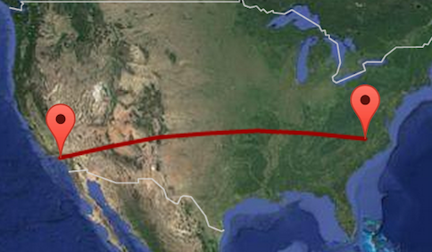
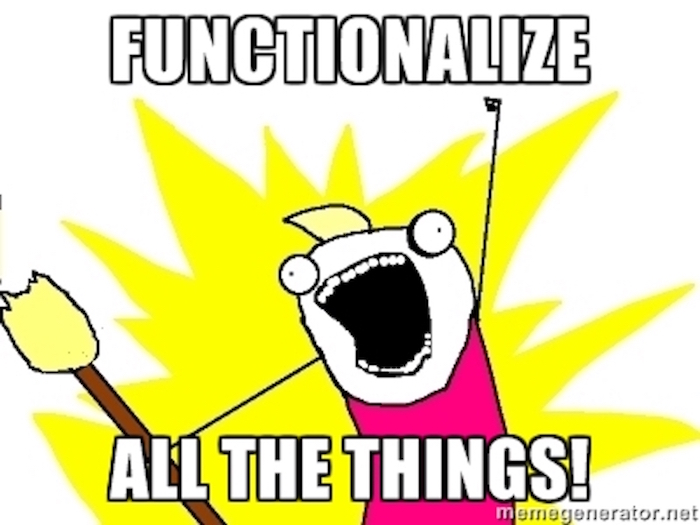

```{r set-options, echo=FALSE, cache=FALSE}
options(width = 90)
#knitr::opts_chunk$set(cache = TRUE)
```

# Today's agenda

## Today's agenda

- Review app ex from last time

- One vs. two sided hypothesis tests

- Functions in R + activity

- **Due Thursday:** App ex - Revisit simulation based inference with functions

# One vs. two sided hypothesis tests

## Types of alternative hypotheses

- One sided (one tailed) alternatives: The parameter is hypothesized to be less than or 
greater than the null value (< or >)

- Two sided (two tailed) alternatives: The parameter is hypothesized to be not equal to 
the null value ($\ne$)
    - Calculated as two times the tail area beyond the observed sample statistic
    - More objective, and hence more widely preferred
    
<div class="question">
Average systolic blood pressure of people with Stage 1 Hypertension is 150 mm Hg. Suppose 
we want to use a hypothesis test to evaluate whether a new blood pressure medication
has an effect on the average blood pressure of heart patients. What are the hypotheses?
</div>

# Functions

## Function Basics

In R functions are first order objects, this means we can work with them like any other 
object in R.

```{r}
f <- function(x){
  x*x
}
list(f)
typeof(f)
```

## Function Parts

The two parts of a function are the arguments (`formals`) and the code (`body`).

```{r}
gcd <- function(loc1, loc2){
  deg2rad <- function(deg) return(deg*pi/180)

  lat1 <- deg2rad( loc1[1] )
  lat2 <- deg2rad( loc2[1] )
  long1 <- deg2rad( loc1[2] )
  long2 <- deg2rad( loc2[2] )

  R <- 6371 # Earth mean radius in km
  d <- acos(sin(lat1) * sin(lat2) + cos(lat1) * cos(lat2) * cos(long2-long1)) * R
  
  return(d) # distance in km
}
```

## Function parts (cont.) {.smaller}

```{r}
formals(gcd)
body(gcd)
```

## Distance between LA and Durham

```{r}
los_angeles <- c(34.052235, -118.243683)
durham <- c(36.002453, -78.905869)

gcd(los_angeles, durham)
```

<div class="centered" style="margin-top: 1em;">

</div>

## Return values

In the preceding slides we have seen two approaches for returning values: explicit and 
implicit return values. The former should be preferred of the later except in the case of very 
simple functions.

**Explicit\:** includes one or more `return`s

```{r}
f <- function(x){
  return(x * x)
}
```

<br/>

**Implicit:** value from last statement is returned

```{r}
f <- function(x){
  x * x 
}
```

## Returning multiple and named values

If we want a function to return more than one value we can group things using either 
vectors or lists.

```{r}
f <- function(x){
  list(value = x, squared = x^2, cubed = x^3)
}
```

<div class="columns-2">
```{r}
f(2)
f(2:3)
```
</div>

## Argument defaults

In R it is possible to give function arguments default values,

```{r}
f <- function(x = 1, y = 1, z = 1){
  paste0("x=", x, " y=", y, " z=", z)
}
```

```{r, error=TRUE}
f()
f(x = 2, y = 4, z = 9)
f(z = 3)
```


## Scoping {.smaller}

R has generous scoping rules, if it can't find a variable in the functions body's scope, it 
will look for it in the next higher scope, and so on. 

```{r}
y <- 1
f <- function(x){
  x + y
}

f(3)

g <- function(x){
  y <- 2
  x + y
}

g(3)
```

## {.smaller}

Additionally, variables defined within a scope only persist for the duration of that scope, 
and do not overwrite variables at the higher scopes.

```{r}
x <- 1
y <- 1
z <- 1
f = function(){
    y <- 2
    g <- function(){
      z <- 3
      return(x + y + z)
    }
    return(g())
}
f()
c(x, y, z)
```

## Getting Help {.smaller}

Prefixing any function name with a `?` will open the related help file for that function.

```{r, eval=FALSE}
?sum
?`+`
?`[`
```

For functions not in the base package, you can also see their implementation by entering 
the function name without parentheses (or using `body` function).

```{r}
lm
```

## When to use functions

The goal of a function should be to encapsulate a *small* *reusable* piece of code.

- Name should make it clear what the function does (think in terms of simple verbs).

- Functionality should be simple enough to be quickly understood.

- The smaller and more modular the code the easier it will be to reuse elsewhere.

- Better to change code in one location than code everywhere.

##

<div class="centered" style="margin-top: 1em;">

</div>

## Activity

<div class="app">
Write a function that takes in the birth month of a person, and outputs the phrase 
"You are a `season` baby!", where `season` is determined by birth month. 

*Hint:* The `paste` function might be useful.
</a>

## Application exercise

Functionalized inference: see course website for details