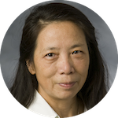
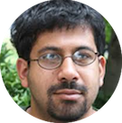

The IDC meets Mondays 6-7:30pm at Market Place Upper East. These sessions will generally feature a guest speaker and dinner will be provided.

* * *

#### Week 1 (Aug 24): 

No meeting.

* * *

#### Week 2 (Aug 31): 

### Meet the 'What If?' team

**Speakers**: 

* Mine Cetinkaya-Rundel, Statistical Science
* Anita Layton, Mathematics
* Jenny Tung, Evolutionary Anthropology
* Lynn Smith-Lovin, Sociology
* Michael Peper, Duke Libraries

* * *

#### Week 3 (Sep 7): The Digital Landscape: Using immersive virtual reality to recreate and interpret archeological heritage

{:.right}

**Speaker**: Regis Kopper  
Director of Duke DiVE

**Host:** Anita Layton

**Abstract:**  Immersive virtual environments have been used in many areas of knowledge
including psychology, engineering, training and education. In this talk
I will present the DiVE, Duke's virtual reality laboratory. I will give
a brief introduction of Virtual Reality (VR), what it is capable of and
what is the state of the art in display technologies. I will then
present the Bass Connection project "The Digital Landscape",  which we
have been developing for the past two years. The goal of this project is
to capture data from archaeological dig sites and create reconstructed 3D
models that can be interactively explored in an immersive virtual
environment. I will conclude by talking about challenges and
opportunities presented when working with truly interdisciplinary teams,
as is the case with Bass Connections projects.

* * *

#### Week 4 (Sep 14): Apply it like you do: Being a modern applied statistician from start to finish

**Host:** Mine Çetinkaya-Rundel

{:.right}

**Speaker**: Beka Steorts  
Assistant Professor of Statistical Science

**Abstract:** Applied statistics involves the integration of mathematical 
statistics, computer science, and domain knowledge about an area of 
application, such as neuroimaging, official statistics, the medical field, 
human rights violations, and others. My research focuses on answering 
fundamental questions in social processes and then building probabilistic 
models to understand such processes. Moreover, this can provide guidance and 
insight to better inform decision in public policy. This talk is in two parts. 
First, we define what applied statistics is in today's world. Second, we 
discuss two applications, the Syrian civil war and predictive modeling using 
electronic health care data. For both applications, I will discuss the 
application, interesting social science questions, and current methods in the 
literature for approaching both problems. 

* * *

#### Week 5 (Sep 21): Starting at a start up: adventures in agriculture

**Host:** Mine Çetinkaya-Rundel

{:.right}

**Speaker:** Jesse Windle  
Director of Data Science at Hi Fidelity Genetics

**Abstract:** I used to be a visiting assistant professor at Duke; now, I am the
first employee at an ag-based startup. In this talk I will tell you about my
transition to the "real world" and how Hi Fidelity Genetics is trying to make
sure there is enough food for an increasingly populous and prosperous world.

* * *

#### Field Trip (Sep 26):

Trip to Beaufort, NC.

* * *

#### Week 6 (Sep 28):

No meeting

* * *

#### Week 7 (Oct 5): A brief introduction to Gaussian processes

**Host:** Mine Çetinkaya-Rundel

{:.right}

**Speaker:** Colin Rundel  
Assistant Professor of the Practice of Statistical Science

**Abstract:** In this talk I will discuss Gaussian processes as a general 
regression-like modeling approach. This will include a review of common 
regression methodologies as well as an introduction to Gaussian process 
based approaches and how they generalize. We'll wrap up with an example 
using Gaussian processes to model air pollution.

* * *

#### Week 8 (Oct 12):

Fall Break - no meeting

* * * 

#### Week 9 (Oct 19): Point of Care Optical Technologies for Women's Health

**Host:** Anita Layton

{:.right}

**Speaker**: Nimmi Ramanujam  
Professor of Biomedical Engineering

**Abstract**: Optical technologies have been exploited widely in the analytical
chemical analysis of biological samples. While the benefits of optical
spectroscopy and microscopy have long been known in the laboratory, over
the past quarter century there has been increasing interest in the
application of these techniques to intact human tissues. One of the
distinct attributes of light is that is provides exquisite chemical
specificity by interacting with a number of molecules that are already
present in the tissue and thus has the capability to provide insight
into functional, morphological and molecular contrast. Our objective is
to exploit the wealth of physiological, metabolic, morphological and
molecular sources of optical contrast to develop novel strategies that
focus on cervical cancer screening and breast cancer diagnostics.

* * * 

#### Week 10 (Oct 26):

**Host:** Anita Layton

{:.right}

**Speaker**: Xiaobai Sun  
Professor of Computer Science

* * * 

#### Week 11 (Nov 2):

**Host:** Anita Layton

{:.right}

**Speaker:** Sayan Mukherjee  
Professor of Statistical Science

* * * 

#### Week 12 (Nov 9): Lessons from Undergraduate Research

**Host:** Mine Çetinkaya-Rundel

{:.right}

**Speaker:** David Clancy  
Undergraduate student at Department of Statistical Science & Mathematics

**Abstract:** Reflections on research as an undergraduate 
including effective communication with others, successful 
planning before and during projects, and finding opportunities 
for research.

* * * 

#### Week 13 (Nov 16): Getting into Data Science Research at Duke: The Data+ Program

**Host:** Anita Layton

{:.right}

**Speaker:** Paul Bendich  
Associate Director for Undergraduate Research at iiD

**Abstract:** Want a first taste of research on a data science team, and get paid 5K
for doing so? The Data+ Program meets for ten weeks over the summer.
Students join small teams working on data-driven problems, often with a
connection to local companies or civic agencies.

Paul Bendich will talk about some of the great projects that happened
last summer (including work on political gerrymandering, hurricane
description via topology, and solar power work using image analysis and
machine-learning), and he will preview some of the possible teams for
next summer.

* * * 

#### Week 14 (Nov 23):

No meeting

* * * 

#### Week 15 (Nov 30): North Carolina workforce incentives through statistical modeling

**Host:** Mine Çetinkaya-Rundel

{:.right}

**Speaker:** Lucy Lu  
Undergraduate student at Department of Statistical Science

**Abstract:** As part of the Data+ program in the past summer, the Workforce 
Incentives team has investigated the efficiency of North Carolina’s economic 
development incentives between 2002 and 2013. The project consisted of 3 stages: 
data collection, modeling and analysis, and result delivery. To determine the 
success of incentives at raising county level wages, a variety of policy- and 
firm-level factors were statistically analyzed using generalized linear models. 
To study the effect of specific policy variables, methods such as propensity 
score matching and survival analysis were also explored.